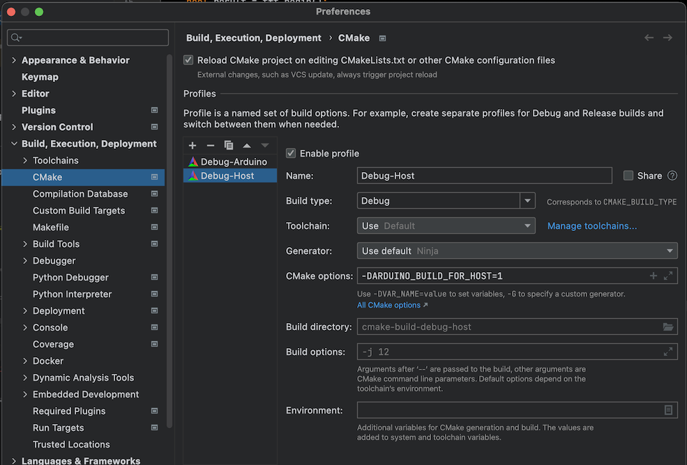
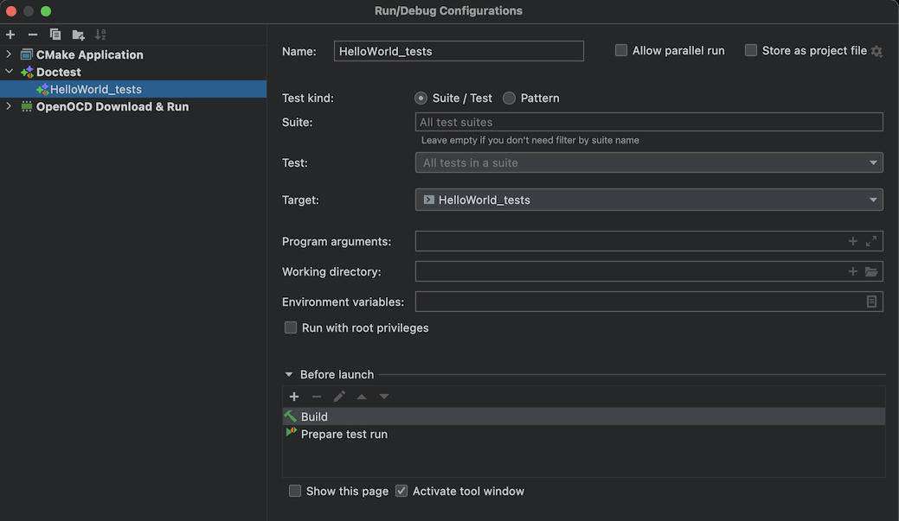
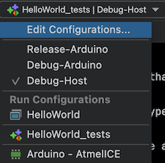

Arduino Due development without Arduino IDE
===========================================

Introduction
------------

This project provides the basic foundation for my development activities using the Arduino Due platform. More
specifically, it provides:

- the basic gcc toolchains for compiling on the Arduino Due platform with associated libraries
- the Arduino core for the Due platform
- some libraries for using Adafruit TFT screens
- building blocks for building projects using CMake
- configuration file for using the Atmel-ICE JTAG interface

### Motivation

The Arduino IDE is perfect for starting with the Arduino platform, especially thanks to its many included demo projects
and the integration with 3rd-party libraries. However, there are some limitations which make using this platform
unsuitable for larger projects.

Atmel Studio helps overcome these limitations. However, it is supported only under Windows (meaning virtualization is
needed on other platforms), and the IDE lacks some features that other platforms provide.

This project enables the use of alternative IDEs through the appropriate command-line tooling. In particular, it enables
integration with CLion, including the use of a JTAG debugger.

### What you need

This project is based on the following tools:

- the ARM toolchain provided by Atmel for the SAM3X8E used on the Arduino Due board;
- CMake for building individual packages (along with any build tool of your choice);
- OpenOCD for programming and debugging via the Atmel-ICE Adapter

### Disclaimer

This project was developed primarily to suit my needs while I'm building experience with more serious development for
the Arduino Due platform. It works very well in my
setup, but may fail miserably in any other environments.

In particular, my setup looks like this:

- MacOS;
- homebrew for bringing in dependencies, including CMake and OpenOCD;
- CLion.

Hardware-wise, here's my setup:

- Arduino Due; this is based on the Atmel SAM3X8E chip (which is based on an ARM Cortex-M3);
- Atmel-ICE Debugger (PCBA Kit)
- [Custom-designed adapters](https://github.com/secolive/AtmelICE-Octopus/) for connecting the Atmel-ICE to the Due's
  JTAG port
- Adafruit 2.2" 18-bit color TFT LCD display with MicroSD card breakout (Product ID: 1480); this is based on the ILI9341
  controller

Content
-------

- `ArduinoCore-Sam/`: submodule referencing the Arduino Core distribution; this is used:
    + as a source for buildingthe Arduino Core;
    + as the provider of the Atmel CMSIS library for the SAM3X8E;
- `Config/CMake/`: repository of CMake configuration scripts providing building blocks to help build software for the
  Arduino Due platform;
- `Config/OpenOCD/`: configuration file for the Atmel-ICE debugger together with the SAM3X8E;
- `HelloWorld/`: basic project; it implements blinking and basic screen output;
- `Libs/`: set of libraries necessary or useful for basic Arduino Due development;
- `Frameworks/doctest/`: doctest framework packaged for Arduino development
- `Toolchain/arm-none-eabi_atmel-6.3.1/`: copy of the toolchain provided by Atmel for the SAM3X8E;
- `Toolchain/bin/`: bunch of scripts.

### Libraries

The `Libs`subfolder contains references to the libraries' sources and provides the necessary CMake configuration for
building them. Additionally, compiled libraries are included for being used as is.

The libraries are:

- `ArduinoLib`: this is the part of the Arduino Core which provides the Arduino APIs
  (i.e. what your code will be using);
- `ArduinoSyscalls`: this is the part of the Arduino Core which provides the necessary
  "glue" for the basic C/C++ stuff to work; usually you don't call these directly, but
  it's impossible to build a flash image without a proper implementation of these syscalls;
- `Adafruit_BusIO`: The Adafruit BusIO library;
- `Adafruit_GFX`: The Adafruit GFX library;
- `Adafruit_ILI9341`: The Adafruit library for driving ILI9341-based displays;
- `ILI9341_due`: An alternative display library for ILI9341-based displays, which can leverage DMA (and hence improve
  performance).

### CMake configuration scripts

Configuration scripts meant to be used by actual projects:

- `ArduinoDue.cmake`: base file for setting up variables necessary for all other scripts, and for setting up the base
  toolchain options;
- `BuildOptionsStandard.cmake`: set of "standard" options traditionally applicable to embedded projects; these are not
  required, so inclusion is optional;
- `BuildPic.cmake`: include to make the build use Position-Independant Code.

Configuration scripts corresponding to individual libraries; each script will define a CMake library object that you can
reference in your target; it will also add the corresponding include directories:

- `libAdafruit_BusIO.cmake`
- `libAdafruit_GFX.cmake`
- `libAdafruit_ILI9341.cmake`
- `libArduinoLib.cmake`
- `libArduinoSyscalls.cmake`
- `libILI9341_due.cmake`

The other configuration scripts are used internally and should not be included in actual projects directly.

Creating new software builds
----------------------------

### Make a library

As a rule of thumb with CMake, create a specific folder for the building of any software package, and put
the `CMakeLists.txt` file there. Never put the source files at this level, put them in a sub-directory instead. Create
a `CMakeLists.txt` file as follows:

1. start with the usual CMake stuff:

        cmake_minimum_required(VERSION 3.17)

2. immediately include ArduinoDue.cmake; this has to be included before the project is defined:

        include(${CMAKE_SOURCE_DIR}/../../Config/CMake/ArduinoDue.cmake)

3. then, define the project and add any general option:

        project(Adafruit_BusIO C CXX ASM)
        set(CMAKE_CXX_STANDARD 17)
        set(CMAKE_C_STANDARD 11)

4. Include any further CMake scripts as appropriate, typically:

        include(${ARDUINO_CMAKE_DIR}/BuildOptionsStandard.cmake)
        include(${ARDUINO_CMAKE_DIR}/BuildPic.cmake)

5. Use the provided scripts to add specific libraries as dependencies to the thing you're building; this will, among
   others, add the correspondig include directories as compiler options:

        include(${ARDUINO_CMAKE_DIR}/libArduinoLib.cmake)

6. Define the source files and include directories for the thing you're building:

        include_directories(src/)
        file(GLOB SOURCES "src/*.c*")

7. Finally, define the target for the library you're building:

        add_library(${PROJECT_NAME} STATIC ${SOURCES})

### Make an executable (flash image)

Perform the same first steps as for a library (steps 1-6 above). Then:

7. Define the executable (ELF) target; you need to make sure to include:
    + an implementation of main; `${ARDUINO_MAIN_SOURCE}` will do if using the Arduino implementation is OK
    + an implementation of the interrupt handlers; `${ARDUINO_HANDLER_SOURCE}` matches the Arduino's implementation; the
      ArduinoLib will not work without the corresponding handlers (in particular the `SysTick_Handler`)

          add_executable(${PROJECT_NAME} ${SOURCES} ${ARDUINO_MAIN_SOURCE} ${ARDUINO_HANDLER_SOURCE})

8. Make sure to link in all dependent libraries, including indirect dependencies; order is important (depender before
   dependee). Make sure to include:
    + a syscalls implementation, for example the Arduino implementation (`ArduinoSyscalls`)
    + the platform core library (`${ARDUINO_LIB_PLATFORM}`)

          target_link_libraries(${PROJECT_NAME} ArduinoLib)
          target_link_libraries(${PROJECT_NAME} ArduinoSyscalls)
          target_link_libraries(${PROJECT_NAME} ${ARDUINO_LIB_PLATFORM})

9. Define the target to be built as a flash image; this will set the proper linking options (use the proper linker
   script and include the startup code):

        buildAsFlashImage(${PROJECT_NAME})

10. Finally, it's recommended to build a bin/hex variant of the target image, it will help you get a sense of the amount
    of flash used by your project:

        generateHexFiles(${PROJECT_NAME})

### Build for the host instead of the target

By defining the variable `ARDUINO_BUILD_FOR_HOST` when invoking CMake, it's possible to use build a package for the
host instead of cross-building for the Arduino target. When this flag is used, the target toolchain is not used, and
the local (default) toolchain will be used instead. Optionally pass a toolchain file to CMake if you want more control
on the toolchain when building for the host.

When building for the host, the flash images will not be selected for building; the corresponding targets will be
ignored alltogether. However, libraries and generla-purpose executables will be built.

It is possible to get more control on what will be built on the host and on the target, using the `doNotBuildForHost`
and `buildOnlyForHost` functions.

### Unit tests with doctest

Unit tests can be added to a project by defining one or more dedicated executable targets. Add the following to your
CMakeLists.txt:

1. Include `Doctest.cmake`:

       include(${ARDUINO_CMAKE_DIR}/Doctest.cmake)

2. Define a new executable target, and include all source files containing the unit tests:

       file(GLOB_RECURSE SOURCES_TEST "tests/*.c*")
       add_executable(${PROJECT_NAME}_tests ${SOURCES_TEST})

4. Flag the executable as a doctest binary:

       buildAsDoctest(${PROJECT_NAME}_tests)

Note that the resulting target can be built either for the target Arduino Due, or directly for the host computer. This
enables you to quickly run the tests as part of the development process (Test-Driven Development).
Use `ARDUINO_BUILD_FOR_HOST` as described above.

Note that when building the unit tests for the target Arduino, an entire flash image will be produced in the form of an
ELF file. The appropriate boiler code is included to run the tests following a reset, outputting resultso n the console
serial port. Note that currentl the resulting image is quite big.

Tooling
-------

### Configure and build

Do `cmake .` and then `make` (will build a "Debug" target). Invoke `cmakeRelease .` or `cmakeMinSizeRel .` instead
of `cmake .` to configure the project in order to build with the corresponding targets ("Release" and "MinSizeRel");
these are simply wrapper scripts making typing a bit easier. As a reminder, the corresponding target-specific build
options are defined in `build-base-options.cmake`.

Using `cmakeHost .` enables configuration of the package to target the host computer instead of the target (Arduino).
This is especially useful when building unit tests, for running them locally.

Note that the generated binaries are put in a sub-folder containing the target name, so that various build types can
coexist for the same piece of software.

### Programming

Programming the flash using the JTAG adapter can be done using OpenOCD. The wrapper script `ArduinoFlash` takes a single
elf file as argument, and will use the JTAG adapter and target as defined
in `Config/OpenOCD/ArduinoDue_AtmelIce.openocd`

### Arduino's serial port

For reference, on MacOS, the serial port of the Arduino will appear as device `/dev/cu.usbmodem14301`.

Integration with CLion
----------------------

CLion can easily be configured to work with projects using the CMake configuration files provided here. The general
configuration steps are as follows:

1. define a toolchain profile pointing to the arm toolchain;
2. configure the project's CMake profile;
3. configure CLion to find OpenOCD;
4. define a run configuration to download and debug the code using the JTAG adapter;
5. (optionally) install and configure the Serial Monitor plugin

### 1. Define the toolchain profile

1. CLion -> Preferences, open the "Build, Execution, Deployment" group, then "Toolchains"
2. Use the "+" Icon then "System" to create a new Toolchain profile
3. Set a meaningful name, set CMake to "Bundled"; Build Tool will be set to "Detected: ninja"
4. For C Compiler, C++ Compiler and Debugger, point to the toolchain's corresponding binaries, i.e. `arm-none-eabi-gcc`
   , `arm-none-eabi-g++` and `arm-none-eabi-gdb` respectively

### 2. Configure the project's CMake profile

Note: Before defining a new CMake profile related to the project in CLion, it is best to ensure there is no leftover
from a previous use of CMake inside the project's structure; delete the `CMakeCache.txt` and `cmake_install.cmake`
files, as well as the `CMakeFiles`directory.

1. CLion -> Preferences, open the "Build, Execution, Deployment" group, then "CMake"; note that this setting is
   project-specific, meaning you have to define it for every new project.
2. Use "+" to add a new profile; select the toolchain profile defined previously, and the appropriate build type (
   typically "Debug"); keep the default build tool
3. There is no need to change any other option in the profile
4. You can repeat a definition e.g. for different build types ("Release" and "MinSizeRel")

_See also [CMake Tutorial in CLion's documentation](https://www.jetbrains.com/help/clion/quick-cmake-tutorial.html)_

### 3. Configure CLion to find OpenOCD

1. CLion -> Preferences, open the "Build, Execution, Deployment" group, then "Embedded Development"
2. If the "OpenOCD Location" is not automatically set, point CLion to the openocd binary on your system (e.g. within the
   homebrew tree)
3. Click on Test to ensure the OpenOCD binary works as expected.

### 4. Define the run configuration

1. Run -> Edit Configurations...
2. Click "+" and then choose "OpenOCD Download & Run"
3. Set a name such as "Arduino - AtmelICE" ; Choose the target elf file as both the Target and Executable; set GDB to
   bundled GDB
4. Point the "Board config file" to `Config/OpenOCD/ArduinoDue_AtmelIce.openocd`

_See also [OpenOCD support in CLion's documentation](https://www.jetbrains.com/help/clion/openocd-support.html)_

### 5. Install and configure the serial monitor plugin

1. CLion -> Preferences, "Plugin"
2. Search for "Serial Port Monitor" and install
3. View -> Tool Windows -> Serial Monitor
4. Ensure your Arduino Board is connected via the USB cable on the management port
5. On the left-hand side of the Serial Monitor pane, click on the wrench ("Settings") icon
6. Set port name to "/dev/cu.usbmodem14301"
7. Set the baud rate to the same value as what your code sets (often 9600 by default, 115,200 recommended)

### Unit testing

CLion can be configured to directly run the doctest unit tests. Once the doctest executable target has been added to
your `CMakeLists.txt`, CLion will automatically find the target to be run as unit tests. However, it is also necessary
to configure the CMake profile enabling a local build for the host.

Details are as follows:

1. CLion -> Preferences, open the "Build, Execution, Deployment" group, then "CMake"; note that this setting is
   project-specific, meaning you have to define it for every new project.
2. Use "+" to add a new profile; keep the default toolchain, select the appropriate build type ( typically "Debug");
   keep the default build tool. Name the profile e.g. as "Debug-Host"
3. Ensure the profile contains the necessary CMake variable by specifying extra command-line arguments:

       -DARDUINO_BUILD_FOR_HOST=1

4. Run -> Edit Configurations...
5. Ensure the configuration for the doctest target was added by CLion, otherwise Click "+" and then choose "Doctest"
6. Ensure the target correspond to the doctest executable target specified in your `CMakeLists.txt`

7. In order to actually run the unit tests, make sure to select the proper run configuration together with the local
   profile created before:

